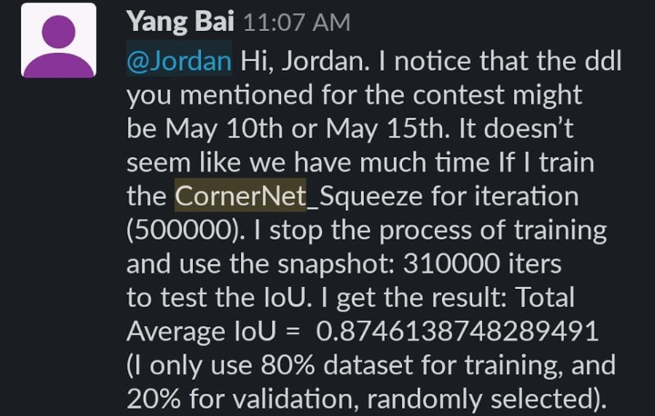

1. First things first, you should install the CornerNet-Lite according to the official installation.

2. Download the data partition and the trained model by the link I give you.

3. mv the dac folder into the data folder and mkdir images folder into the dac. Then put the DAC dataset (95 classes) into the images.

4. mv the CornerNet_Squeeze_310000.pkl into the cache/nnet/CornerNet_Squeeze

5. If you don't find the cache/nnet/CornerNet_Squeeze folder, you can mkdir it into the CornerNet-Lite-master folder.

6. Using python test_iou.py, you can get the evaluation of IoU on the validation.
---

